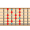
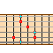
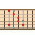

### chipset music lessons

- Learn music improvisation through short lessons delivered in a style reminiscent of 8 bit computer games.
- Backing tracks are 8 bit chiptune loops
- instrument and fingering diagrams are pixel art
- As an app, a user can score points, level up, create a character/avatar in 8 bit pixel format.

